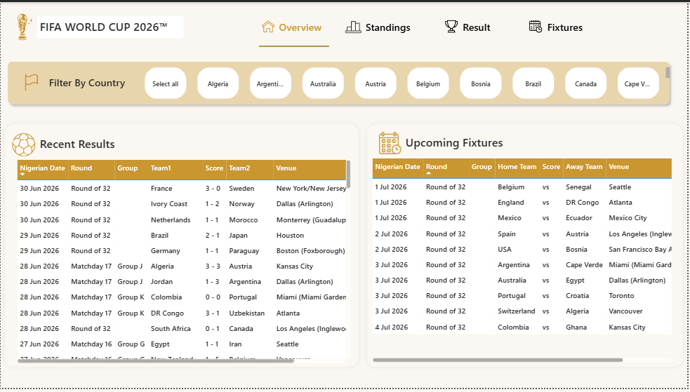
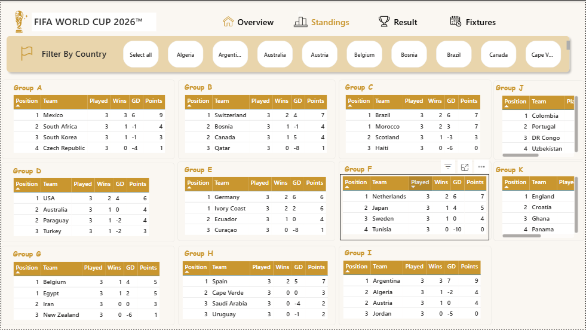
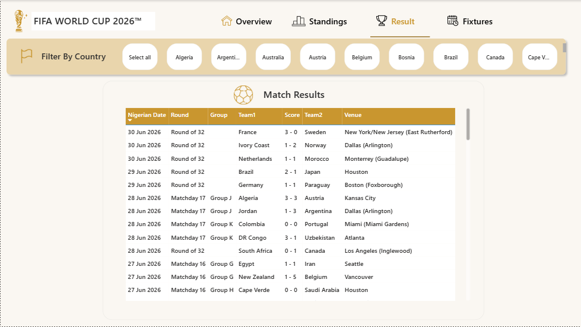
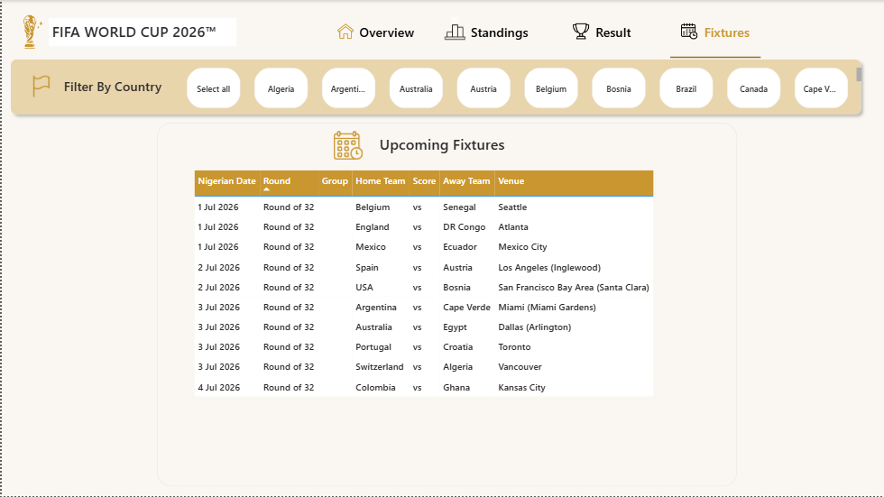

# FIFA World Cup 2026 Power BI Dashboard

An interactive 4-page Power BI dashboard tracking the FIFA World Cup 2026 — live standings, match results, and upcoming fixtures, with all times converted to West Africa Time (WAT).

🔗 [Live interactive dashboard](https://app.powerbi.com/links/dzeb4Hyk6g?ctid=b1147ebc-723a-4081-b981-f0ae8a56561e&pbi_source=linkShare&bookmarkGuid=bfe86e9f-4fe9-4003-a119-fbe83ce45e07)

## Features
- Country filter slicer affecting all data tables
- Standings broken out by all 12 groups, with auto-calculated position, points, and goal difference
- Match results with combined score formatting
- Upcoming fixtures, automatically excluding undetermined knockout-stage matchups
- All kickoff times converted from each match's local US/Mexico/Canada timezone into Nigerian time

## Data Source
Built from the [openfootball/worldcup.json](https://github.com/openfootball/worldcup.json) public domain dataset, refreshed via Power Query.

## Technical highlights
- Custom Power Query transformations: nested JSON expansion, dynamic timezone conversion with date-rollover handling, multi-table relationship modeling
- DAX RANKX for per-group standings rank
- Bridge table design to resolve a many-to-many filtering problem (team appears in two separate columns)

## Screenshots

